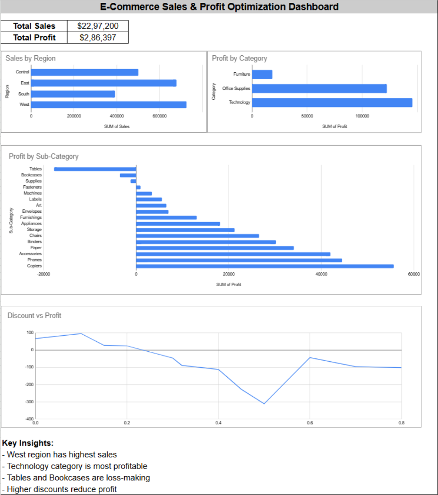

# 📊 E-Commerce Sales & Profit Optimization Dashboard

## 📌 Project Overview

This project analyzes an e-commerce dataset to uncover insights related to sales performance, profitability, and pricing strategies. The goal is to help businesses make data-driven decisions to improve overall performance.


## 🛠 Tools & Technologies Used

* **Python (Pandas)** – Data cleaning and feature engineering
* **SQL (SQLite)** – Data querying and analysis
* **Google Sheets (Pivot Tables & Charts)** – Data visualization and dashboard creation


## 🔍 Key Analysis Performed

* Analyzed sales performance across different regions
* Evaluated profitability by category and sub-category
* Identified loss-making products
* Studied the impact of discounts on profit margins


## 📊 Dashboard Preview
Below is the interactive dashboard showcasing key business insights:




## 💡 Key Insights

* West region generates the highest sales
* Technology category is the most profitable
* Sub-categories like Tables and Bookcases are loss-making
* Higher discounts negatively impact profitability


## 🚀 Conclusion

The analysis highlights key areas where businesses can improve profitability by optimizing pricing strategies, reducing unnecessary discounts, and focusing on high-performing product categories.


## 📁 Project Structure

```
Project1-Sales-Analysis/
│
├── analysis.py
├── SampleSuperstore.csv
├── sales.db
├── dashboard.png
├── README.md
```


## What I Learned

* End-to-end data analysis workflow
* Writing SQL queries for business insights
* Creating dashboards for decision-making
* Translating data into actionable insights
